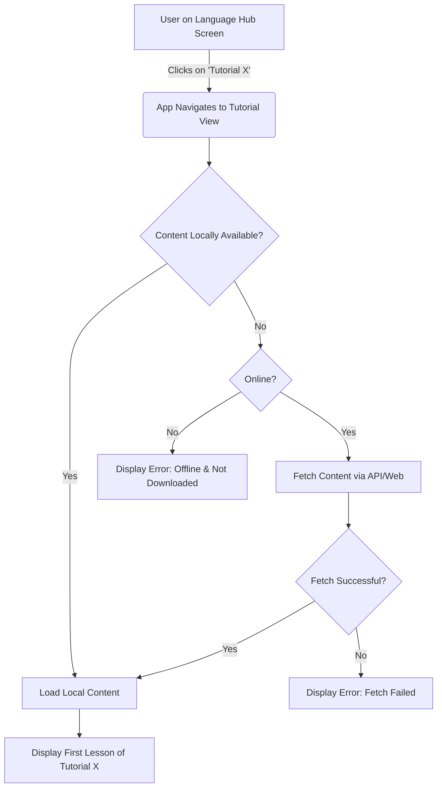

# User Flow Documentation: CodePath AI

This document outlines the primary user flows within the CodePath AI application. As the app is designed for personal use without authentication, these flows are streamlined for direct content access and interaction.

## 1. Application Launch & Initial View

*   **Trigger:** User opens the web application (navigates to the URL) or launches the mobile app.
*   **System Actions & UI Response:**
    1.  The application initializes.
    2.  It checks for any locally stored user data, such as:
        *   Previously selected programming language.
        *   Progress in tutorials or languages.
        *   List of tutorials already downloaded for offline use.
    3.  The main dashboard or home screen is displayed.
    4.  **Home Screen Key Elements:**
        *   A clear option to select or change the current programming language (e.g., a dropdown, a prominent button, or a section displaying language cards).
        *   A list or grid of available programming languages (e.g., Python, JavaScript, Java, C++, etc.), possibly with icons.
        *   *(If prior activity exists)* A "Recently Viewed Tutorials" or "Continue Learning" section, providing quick links to jump back into ongoing lessons.
        *   A visual indicator of the current online/offline status of the application.
        *   A navigation element (e.g., settings icon) for accessing app settings (like triggering content updates, if manually controlled).

## 2. Selecting a Programming Language

*   **User Action:**
    *   Clicks on a "Select Language" button/dropdown and chooses a language.
    *   Or, directly clicks on a language card/entry from the list on the home screen.
*   **System Actions & UI Response:**
    1.  The application navigates to the dedicated screen for the chosen language (e.g., "Python Hub," "JavaScript Hub").
    2.  **Language Hub Screen Key Elements:**
        *   The name of the selected language is prominently displayed.
        *   A list of available tutorials for that language is shown (e.g., "Python Basics," "Object-Oriented Python," "Python for Data Analysis"). Each tutorial might show a brief description or estimated duration.
        *   *(If progress tracking is implemented)* An overview of the user's progress within that specific language.
        *   An option to download all tutorials for the selected language for offline access (or an indicator if they are already fully downloaded).
        *   Individual tutorials might also show their download status (downloaded, not downloaded, download in progress).

## 3. Selecting and Starting a Tutorial

*   **User Action:** From the Language Hub screen, the user taps or clicks on a specific tutorial from the list.
*   **System Actions & UI Response:**
    1.  The application navigates to the main "Tutorial View" screen for the selected tutorial.
    2.  **Content Loading Logic:**
        *   If the tutorial content is already available locally (downloaded), it is loaded directly.
        *   If the content is not available locally and the app is online, it attempts to fetch the content from the Google Gemini API or the relevant web source.
        *   If the app is offline and the content is not downloaded, an appropriate message is displayed (e.g., "This tutorial is not available offline. Please connect to the internet to download.").
    3.  The first lesson or section of the tutorial is displayed.
    4.  **Tutorial View Screen Key Elements:**
        *   Tutorial title and possibly a brief introduction.
        *   The main content area displaying the current lesson's text, code examples (syntax highlighted), images, etc., as provided by the Gemini API or web source.
        *   Navigation controls: "Next Lesson," "Previous Lesson" buttons.
        *   A button or link to access a Table of Contents or a list of all lessons within the tutorial for quick navigation.
        *   *(Potential Feature)* An area for interactive coding exercises related to the current lesson.
        *   *(Potential Feature)* A button or toggle to mark the current lesson or the entire tutorial as complete. Progress indicators (e.g., a progress bar) for the tutorial.

## 4. Navigating Through a Tutorial

*   **User Action:**
    *   Clicks the "Next Lesson" or "Previous Lesson" buttons.
    *   Selects a specific lesson from the Table of Contents/Lesson List.
*   **System Actions & UI Response:**
    1.  The content for the requested lesson is loaded and displayed in the main content area.
    2.  *(If progress tracking is implemented)* The user's progress within the tutorial is updated (e.g., marking lessons as viewed or completed).
    3.  The navigation controls (Next/Previous buttons) are updated based on the current lesson's position (e.g., disable "Previous" on the first lesson, change "Next" to "Finish Tutorial" on the last lesson).

## 5. Completing a Tutorial

*   **User Action:**
    *   Reaches the end of the last lesson and clicks a "Finish Tutorial" or "Complete" button.
    *   Manually marks the tutorial as complete through an option in the Tutorial View.
*   **System Actions & UI Response:**
    1.  *(Potential Feature)* Displays a completion message, congratulations, or a summary of what was learned.
    2.  Updates the overall progress for the language in which the tutorial resides.
    3.  May suggest the next tutorial in a series or provide options to return to the Language Hub or the Home screen.

## 6. Using Offline Mode

*   **Scenario:** The user opens the application or is using it when the internet connection is lost or unavailable.
*   **System Actions & UI Response:**
    1.  The application loads and operates using locally stored data (downloaded tutorials, user progress).
    2.  A clear visual indicator (e.g., a banner, icon) informs the user that they are in "Offline Mode."
    3.  Only tutorials and content that have been previously downloaded are accessible. Non-downloaded content will be greyed out or marked as unavailable.
    4.  Features requiring an active internet connection (e.g., fetching new/undownloaded tutorials, certain live interactions with the Gemini API beyond cached/pre-generated content, checking for web updates) are gracefully disabled or inform the user of the online requirement.

## 7. Content Update Flow (User-Triggered for MVP)

*   **User Action:** *(If a manual update feature is implemented)* User navigates to app settings or a dedicated update section and clicks a "Check for Updates," "Sync Content," or similar button.
*   **System Actions & UI Response:**
    1.  If the app is online, it initiates a process to:
        *   Fetch the latest list of available tutorials/content from predefined web sources.
        *   Or, trigger calls to the Google Gemini API for new or updated structured content based on its internal logic.
    2.  The system compares the newly fetched information with the locally stored content.
    3.  New or changed materials are downloaded and stored locally.
    4.  The user interface provides feedback on the update process (e.g., "Checking for updates...", "Downloading new content (X/Y MB)...", "Content is up to date," "X new tutorials added").

## 8. Error Handling Examples During User Flows

*   **No Internet Connection (when attempting to fetch undownloaded content):**
    *   *Message:* "No internet connection. Please connect to download this tutorial or access online features."
*   **Google Gemini API Error (e.g., rate limit, server error, invalid key):**
    *   *Message:* "Could not load content at this time. Please try again later or check your internet connection." (Detailed error should be logged for the developer/user to debug API key issues).
*   **Content Not Found (during web update from a specific source):**
    *   *Message:* "Could not retrieve updates from source [source name]. It might be temporarily unavailable."
*   **Local Storage Full (during download of tutorials for offline use):**
    *   *Message:* "Not enough local storage space to download more content. Please free up some space on your device."
*   **Invalid File Format (if fetched content is malformed):**
    *   *Message:* "Downloaded content appears to be corrupted. Please try updating again." (Log details for debugging).

## Mermaid Diagram Structure (Conceptual for Future Conversion)

Each user flow described above can be visually represented using Mermaid.js sequence diagrams or flowcharts. For example, the "Selecting and Starting a Tutorial" flow:

This textual structure provides a foundation for creating detailed visual flow diagrams.